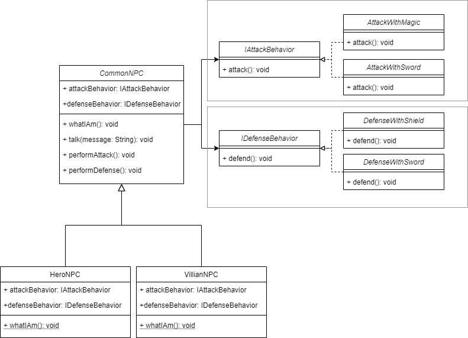

# Strategy Pattern

*This definition was obtained from the book [Head First Desing Patterns](https://www.amazon.com/-/es/Eric-Freeman/dp/0596007124)*

:::warning 
Take what varies and "encapsulate" it so it won't affect the rest of your code. It will result on fewer unintended consequences from code changes and more flexibility in your systems. If you have got some aspect on your code that is changing, say with every new requierement, then you know you have got a behavior that needs to be pulled out and separated from all the stuff that doesn't change.

Take the parts that vary and encapsulate them, so later you can alter or extend the parts
that vary without affecting those that do not.

The strategy pattern defines a family of algorithms, encapsulates each one,
and makes them interchangeable. Strategy lets the algorithm vary independently
from the clients that use it.
:::

 

### Desing principles
* Identify the aspects of your application that vary and separate them from what stays the same.
* Program to an interface, not an implementation.
* Favor composition over inheritance.

### The example

